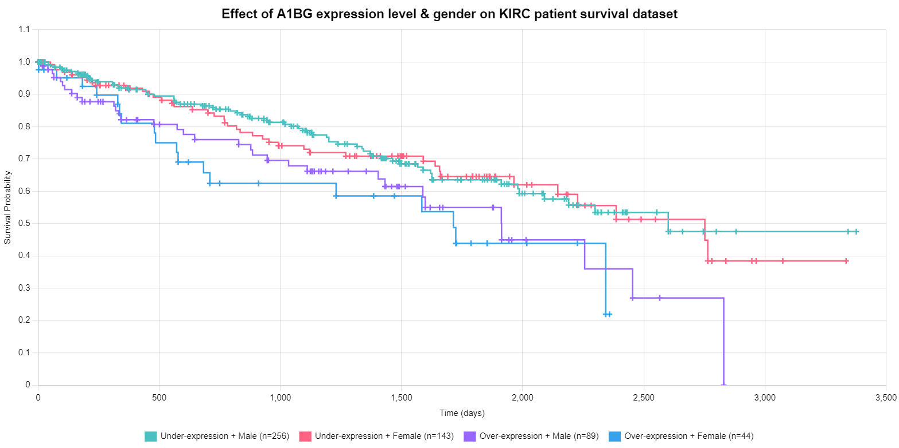

# Kaplan Meier Graph

KMPen is a visualization tool to create Kaplan Meier survival probability graph.

### Features
#### KIRC:
- Separate dataset into groups.
- Create KM survival probability graph for each group.
- Read fixed text datafiles and extract data based on them.
- The project can extract columns and rows.
- Export graph as PNG, JPG, and PDF format.
#### Basic:
- Create Kaplan-Meier survival probability graph based on dataset mentioned in paper [Understanding survival analysis: Kaplan-Meier estimate](https://www.ncbi.nlm.nih.gov/pmc/articles/PMC3059453/).
- The project can create random dataset and generate Kaplan-Meier survival graph based on the dataset.
- Download graph as PNG, JPG, and PDF format.
- Responsive graph

### Demo (KIRC)

- Graph with data
  
- Effect of A1BG expression level & race on KIRC patient survival dataset
  
- Effect of A1BG expression level & gender on KIRC patient survival dataset
  

### Demo (Basic)

- Graph with data
  
- Data
  
- Kaplan Meier Survival Probability Graph
  


### Library used
- jQuery: Version 3.6.0.min
- ChartJS: Version 3.6.2
- Datatable: Version 1.11.3
- jsPDF: Version 1.3.2
- Bootstrap: Version 5.1.3
- Bootstrap Icons: Version 1.5.0

## ToDo
- Add convert to SVG button. Tutorial can be found in [Canvas to SVG](https://editor.p5js.org/jeffThompson/sketches/9UBWBj32R).
- Fix chart in small screen (mobile)

## Support

Please [open an issue](https://github.com/arsho/kmpen/issues/new) for support.

## Contributing

Please contribute using [Github Flow](https://guides.github.com/introduction/flow/). Create a branch, add commits, and [open a pull request](https://github.com/arsho/kids_math/compare/).

### Git methods
- Create new branch:
    ```
    git fetch origin
    git checkout master
    git reset --hard origin/master
    git checkout -b BRANCH_NAME
    ```    
- To check local changes:
    ```
    git status -s
    ```
- Commit changes:
    ```
    git add --all
    git commit -m "Issue:Issue_Number message"
    git push origin BRANCH_NAME
    ```    
- To fetch from upstream repository:
    ```
    git fetch origin
    ```
- To reset local files to upstream repository `main` branch after fetching the changes:
    ```
    git reset --hard origin/main
    ```

### Resources
- [Understanding survival analysis: Kaplan-Meier estimate](https://www.ncbi.nlm.nih.gov/pmc/articles/PMC3059453/)
- [A PRACTICAL GUIDE TO UNDERSTANDING KAPLAN-MEIER CURVES](https://www.ncbi.nlm.nih.gov/pmc/articles/PMC3932959/)
- [Chartjs line chart documentation](https://www.chartjs.org/docs/3.6.2/charts/line.html)
- [Chartjs graph export](https://www.chartjs.org/docs/3.6.2/developers/api.html#tobase64image-type-quality)
- [JSPDF documentation](https://github.com/matb/jsPDF)
- [Chartjs canvas background](https://www.chartjs.org/docs/3.6.2/configuration/canvas-background.html)
- [Kaplan Meier graph example](https://canvasxpress.org/examples/kaplan-meier-1.html)
- [Remove some points in line chart chartjs - Javascript Chart.js](http://www.java2s.com/example/javascript/chart.js/remove-some-points-in-line-chart-chartjs.html)
- [Current demo](http://ualcan.path.uab.edu/cgi-bin/TCGA-survival1.pl?genenam=A1BG&ctype=KIRC)